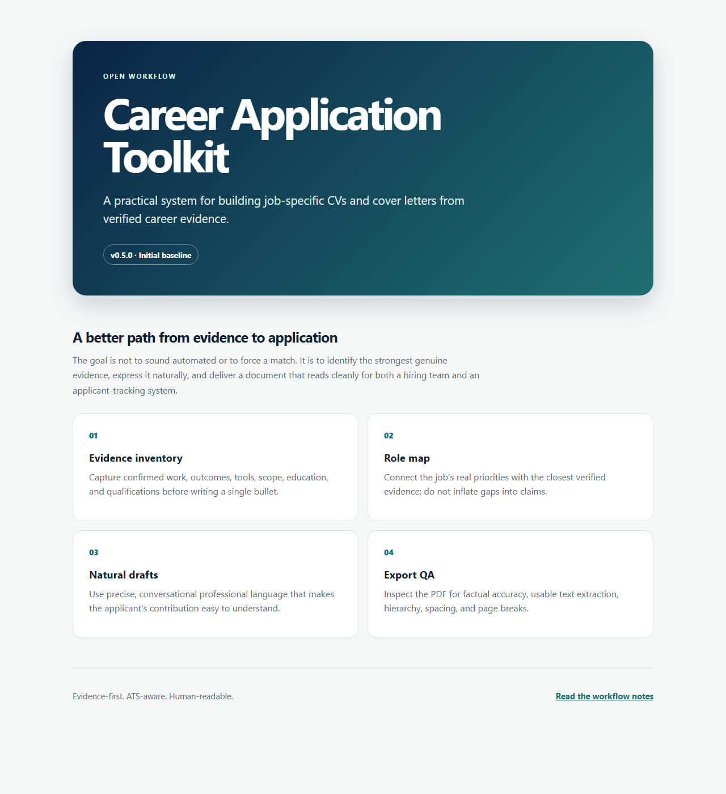

# Career Application Toolkit

> Evidence-first CV and cover-letter tailoring workflow.

This public guide provides a disciplined way to produce role-specific application materials without inventing achievements, stuffing keywords, or relying on generic AI prose. It is a workflow and static landing page, not an automated CV generator.

*Authentic preview of the included `index.html` page.*

## Core principles

1. **Start with evidence.** Build from verified responsibilities, outcomes, tools, scope, and dates.
2. **Map the role before drafting.** Match real career evidence to the employer's requirements and priorities.
3. **Write like a person.** Prefer clear, direct wording over inflated claims, vague buzzwords, and template language.
4. **Keep the layout parser-safe.** Use a conventional structure, readable headings, and straightforward formatting that works for people and ATS software.
5. **Verify the exported file.** Check every PDF for text extraction, pagination, visual hierarchy, and factual accuracy.

## Workflow

1. Capture the job posting and identify the responsibilities, constraints, and success measures.
2. Assemble an evidence inventory from the candidate's confirmed work, education, and qualifications.
3. Create a role-to-evidence map; omit unsupported claims instead of stretching the match.
4. Draft a focused CV and cover letter that explain the candidate's most relevant contribution.
5. Review the language for specificity, tone, consistency, and unsupported superlatives.
6. Export and inspect the final PDF before submitting.

## v0.5.0

The initial release establishes the evidence-first workflow, practical quality guardrails, and a lightweight project landing page. It deliberately contains no personal profile data, application documents, credentials, or generated files.

## Status

An initial, reusable workflow. Open `index.html` in a browser to view its landing page; no installation or account is required. The guide does not include anyone's CV, application history, or personal data.

## License

The original source and documentation on the current `main` branch are available under the [MIT License](LICENSE). The historical `v0.5.0` tag predates that license; its source archive is not retroactively MIT-licensed. Create and share application materials only with the candidate's permission, and verify every claim before submitting.
